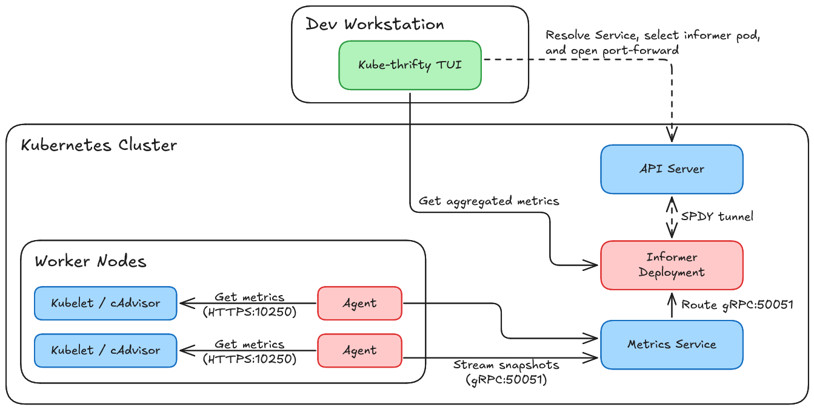

# Kube-Thrifty

Kube-Thrifty is a Kubernetes resource monitor TUI. It collects CPU and memory metrics of containers on all nodes, compares container usage with resource requests, and highlights containers that may be overprovisioned.

Kube-Thrifty is read-only. It does not modify workloads, requests, or limits.

## Features

- Cluster-wide node and container metrics in a TUI
- Live CPU rate, throttling, and request utilization
- Live memory working set, resident set, OOM events, and request utilization
- Approximately five minutes of utilization history
- Sorting by name, usage, or efficiency (utilization)
- Filtering by namespace or pod
- Warnings for missing resource requests and limits

## Architecture



The agent runs on every node, scrapes metrics every 10 seconds, and streams them to the informer via Service. The informer aggregates snapshots from nodes, caches it, and serves it through HTTP. The local TUI finds the informer Service through your kubeconfig and polls its HTTP API every five seconds.

## Prerequisites

- A Kubernetes cluster whose kubelets expose cAdvisor metrics on port `10250`
- A working kubeconfig in `KUBECONFIG` or `$HOME/.kube/config`
- [Helm 3](https://helm.sh/)
- [Go 1.26.2](https://go.dev/) to build or run the TUI from source

> [!Note]
> Your Kubernetes identity should be able to reach the API server, read the Kube-Thrifty Service and pods, and open pod port-forward connections.

## Quick Start

Install kube-thrifty from repository root:

```sh
helm install kube-thrifty ./infra/kube-thrifty-chart \
  -n kube-thrifty \
  --create-namespace
```

Wait for the workloads:

```sh
kubectl rollout status deployment/kube-thrifty-informer-deployment -n kube-thrifty
kubectl rollout status daemonset/kube-thrifty-agent-daemonset -n kube-thrifty
```

Run the TUI:

```sh
cd code/tui
go run .
```

> [!Note]
> The release name and namespace must currently both be `kube-thrifty`. TUI uses the Service name and namespace directly.

## Controls

| Key | Action |
| --- | --- |
| `j` / `k`, arrows | Move cursor |
| `Enter` | Open container details |
| `c` | Show CPU metrics |
| `m` | Show memory metrics |
| `s` | Open sorting prompt |
| `/` | Filter by namespace or pod |
| `?` | Open or close help |
| `Esc` | Cancel a prompt or close help |
| `q` | Return from details or quit from the main view |
| `Ctrl-C` | Quit |

At the sorting prompt, press `e` for efficiency (utilization), `u` for usage (Working set byte for memory view; CPU rate for CPU view), or `Enter` for name (default).

Utilization is calculcated as the ratio between CPU rate or Working set byte and the corresponding container's resource request. Containers without a request display `N/A`. A container is marked as potentially overprovisioned when its historical average utilization is below 25%.

## Helm Configurations

| Value | Default | Description |
| --- | --- | --- |
| `mode` | `prod` | Set to `dev` for debug logging and profiling |
| `agent.image.repo` | `brianhdevv/kube-thrifty-agent` | Agent image repository |
| `agent.image.tag` | `latest` | Agent image tag |
| `informer.image.repo` | `brianhdevv/kube-thrifty-informer` | Informer image repository |
| `informer.image.tag` | `latest` | Informer image tag |

The chart deploys:

- An agent `DaemonSet`
- A single-replica informer `Deployment`
- A `ClusterIP` Service for gRPC and HTTP
- Agent RBAC resources

## Repository Structure

```text
.
|--code/
   |--tui/                 # Local terminal application
   |--scraper/
      |--agent/            # Node scraper and agent image
      |--informer/         # gRPC aggregator and HTTP API
      |--proto/            # Metrics protocol definition
      |--gen/              # Generated protobuf bindings
      |--utils/            # Development profiler
|--infra/
   |--kube-thrifty-chart/  # Helm chart
```

## Current Limitations

- Removed nodes are not automatically updated in TUI and are not removed from informer cache.
- The informer runs as a single replica.
- Release name and namespace are fixed for TUI discovery.
- Agent-to-informer gRPC is unencrypted inside the cluster.
- Kubelet TLS certificates are not verified by the agent.
- The chart defaults to `latest` image tags.

## License

Kube-Thrifty is licensed under the MIT License. See [LICENSE](LICENSE).
